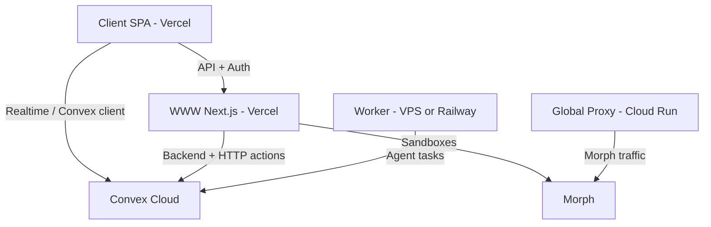

# End-to-End Deployment Guide

This guide walks through deploying the cmux (Manaflow) application from scratch: acquiring all required credentials, configuring each service, and verifying the deployment.

---

## Table of Contents

1. [Prerequisites](#1-prerequisites)
2. [Architecture Overview](#2-architecture-overview)
3. [Environment Variables Reference](#3-environment-variables-reference)
4. [Acquiring Credentials](#4-acquiring-credentials)
5. [Deploying Services](#5-deploying-services)
6. [Webhook Configuration](#6-webhook-configuration)
7. [Deployment Order](#7-deployment-order)
8. [Verification Checklist](#8-verification-checklist)
9. [Troubleshooting](#9-troubleshooting)

---

## 1. Prerequisites

### Accounts (create before starting)

| Service | URL | Purpose |
|---------|-----|---------|
| Convex | https://convex.dev | Backend (database, functions, HTTP actions) |
| Vercel | https://vercel.com | Hosting for www (Next.js) and client (Vite SPA) |
| Stack Auth | https://stack-auth.com | Authentication (teams, users, OAuth) |
| GitHub | https://github.com | GitHub App for repo access and webhooks |
| Morph | https://cloud.morph.so | Sandbox VMs for task runs |
| Modal | https://modal.com | Serverless workloads (snapshots, etc.) |
| Google Cloud | https://console.cloud.google.com | Global proxy (Cloud Run) – optional |

### Local environment

- **Bun** (recommended) or Node 24+: https://bun.sh or https://nodejs.org
- **Git**: repository cloned
- **Docker** (optional): only if you will run the worker or build images locally

### Repository setup

```bash
git clone <your-repo-url>
cd manaflow
bun install
```

---

## 2. Architecture Overview



- **Client** (Vite SPA): User-facing app; calls www for API and Convex for realtime data.
- **WWW** (Next.js): API routes (Hono), auth handlers, preview dashboard; talks to Convex and Morph.
- **Convex**: Database, serverless functions, HTTP endpoints (e.g. webhooks, Crown, devbox).
- **Global proxy**: Rust service on Cloud Run; proxies traffic to Morph sandboxes (required for Morph).
- **Worker**: Optional; runs agent workloads (Codex, Claude, etc.) and reports back to Convex.

### 2.1 What each deployment is (and why that service)

Each deployable piece is one part of the application, chosen for a specific job and hosted on a service that fits that job.

| Deployed part | What it is in the repo | What it’s for in the application | Why this service |
|---------------|------------------------|-----------------------------------|-------------------|
| **Convex** | `packages/convex`: backend database, serverless functions, HTTP actions | **Persistence and serverless backend:** Stores tasks, task runs, teams, users (synced from Stack Auth), GitHub PRs, sandbox state. Serves realtime subscriptions to the client. Runs serverless logic (Crown, preview jobs, devbox/cmux instance APIs). Exposes HTTP endpoints for Stack and GitHub webhooks, Anthropic proxy, screenshot upload, etc. | **Convex Cloud** gives one backend for realtime DB + functions + HTTP, so we don’t run a separate database and API server. Fits the stack and scales automatically. |
| **apps/www** | `apps/www`: Next.js app with Hono API routes | **Server-rendered pages and main API surface:** Marketing/landing pages, auth handlers (Stack sign-in, connect-GitHub). Hono/OpenAPI routes for sandboxes (Morph/E2B), code review, repos, environments, health. The client calls these APIs; www also talks to Convex and Morph. | **Vercel** is built for Next.js (SSR, API routes, serverless). One platform for both the site and the API the client hits. |
| **apps/client** | `apps/client`: Vite React SPA | **The product UI:** Dashboard, task list, task runs, diff viewer, terminals, settings, PR views. Runs in the browser; calls www for REST/OpenAPI and Convex for realtime data and auth-backed mutations. | **Vercel** hosts the static/SPA build and serves it with a stable URL and TLS. Same ecosystem as www; preview deployments per branch. |
| **Global proxy** | `apps/global-proxy`: Rust HTTP proxy | **Traffic to Morph sandboxes:** Proxies requests from the browser (and sometimes IDE) to Morph VMs. Handles subdomain routing (e.g. `cmux-&lt;id&gt;-base-39383.cmux.app`) and CORS so the client can talk to VSCode/xterm on the sandbox. | **Google Cloud Run** runs a single container with a stable URL and TLS. Fits a long-lived proxy that isn’t serverless and needs to be reachable from the public internet. |
| **Worker** | `apps/worker`: Node/Bun process | **Coding agents:** Long-running process that runs Codex, Claude, or other agents. Triggered by or coordinated with Convex; runs tasks (e.g. code review, Crown), then reports results back to Convex. | **Railway / Render / Fly.io / VPS** run a persistent process. Serverless time limits don’t fit agent runs; a dedicated process can stay connected and run for minutes or more. |

In short: **Convex** is the core backend (data + serverless + webhooks). **WWW** is the web site and the API the client calls. **Client** is the UI. **Global proxy** is the gateway to Morph sandboxes. **Worker** is the optional agent runner.

### 2.2 Why the Worker is optional (and what happens when it’s not used)

The Worker is optional **as a separate deployment** because the worker process (`apps/worker`) is designed to run **inside each sandbox**, not only as a standalone service.

- **Cloud mode (Morph):** The Morph snapshot built by `scripts/snapshot.py` includes a **build-worker** step that bundles `apps/worker` into the image and runs it as `cmux-worker.service` (see `configs/systemd/cmux-worker.service`). When a Morph VM boots, the worker starts inside that VM. The main server (or the system that orchestrates sandboxes) connects to the worker’s management socket to create terminals, run agent commands (Codex, Claude, etc.), and run `worker:exec` (e.g. auto-commit). So for cloud task runs you do **not** need to deploy the Worker as its own service—it’s already in the sandbox image.

- **Local mode (Docker):** When using the Electron app and local Docker, the worker runs inside the same Docker container that the server spawns (the `docker.io/manaflow/cmux`-style image). Again, the worker is bundled in the image; there is no separate Worker deployment.

So “optional” here means: **optional to deploy as a separate long‑running service** (e.g. on Railway). If you only use Morph (and/or local Docker) with the standard images that include the worker, agent runs work without any standalone Worker deployment.

**What happens when the worker is not used at all** (e.g. a sandbox that doesn’t have the worker, or the worker process isn’t running in the sandbox):

- The **main server** (or orchestrator) expects to connect to the worker’s management socket to create PTY terminals and run agent commands (see `apps/server` socket handlers and `agentSpawner.ts`: it sends `worker:create-terminal`, `worker:exec`, etc.). If no worker is present or reachable in that sandbox:
  - Terminal creation for that task run fails or never completes.
  - Agent execution (Codex, Claude, etc.) does not run in that sandbox.
  - Crown completion and auto-commit (which use the worker’s `worker:exec` and Crown callbacks) don’t run for that run.

So the worker is **required inside each sandbox** for full agent behavior; it’s **optional only as an extra, separately deployed service** (e.g. for a shared worker pool or a different execution model). **The repo is already set up for this:** the root `Dockerfile` builds and runs the worker inside the Docker image (port 39377, `cmux-worker.service`), and the Morph snapshot (`scripts/snapshot.py` task `build-worker`) bundles the worker into each VM. No separate Worker deployment is needed for standard cloud or local runs.

---

## 3. Environment Variables Reference

Variables are defined in:

- **Convex (backend)**: `packages/convex/_shared/convex-env.ts`
- **WWW (Next.js)**: `apps/www/lib/utils/www-env.ts`
- **Client (Vite)**: `apps/client/src/client-env.ts`

### 3.1 Convex (packages/convex)

Set via Convex Dashboard **Settings → Environment Variables** or `npx convex env set KEY value`.

| Variable | Blocking? | Required | Where to acquire | Notes |
|----------|-----------|----------|------------------|-------|
| `STACK_WEBHOOK_SECRET` | Yes | Yes | Stack Auth dashboard → Webhooks | Verifies Stack webhook; without it team/user sync fails. |
| `BASE_APP_URL` | Yes | Yes | You choose | Used in redirects, callbacks, links (e.g. `https://app.manaflow.com`). |
| `CMUX_TASK_RUN_JWT_SECRET` | Yes | Yes | Generate | Signs/verifies task-run JWTs (worker auth, Crown HTTP). |
| `MODAL_TOKEN_ID` | Yes | Yes | Modal dashboard | Modal serverless; Convex env schema requires it. |
| `MODAL_TOKEN_SECRET` | Yes | Yes | Modal dashboard | Modal serverless; Convex env schema requires it. |
| `STACK_SECRET_SERVER_KEY` | Yes for auth | Recommended | Stack Auth → API Keys | Server-side Stack API; needed for auth and backfills. |
| `STACK_SUPER_SECRET_ADMIN_KEY` | No | Optional | Stack Auth | Admin-only operations (e.g. backfills). |
| `NEXT_PUBLIC_STACK_PROJECT_ID` | Yes for auth | Yes for auth | Stack Auth | Client auth; required for sign-in and teams. |
| `NEXT_PUBLIC_STACK_PUBLISHABLE_CLIENT_KEY` | Yes for auth | Yes for auth | Stack Auth | Client auth; required for sign-in and teams. |
| `GITHUB_APP_WEBHOOK_SECRET` | If using GitHub | Yes for GitHub | GitHub App → Webhook secret | GitHub webhook returns 501 without it; PR/repo sync fails. |
| `INSTALL_STATE_SECRET` | No | Optional | Generate | Encrypts install-state for GitHub App install flow. |
| `CMUX_GITHUB_APP_ID` | If using GitHub | Yes for GitHub | GitHub App | GitHub API (repos, PRs, install); required for repo features. |
| `CMUX_GITHUB_APP_PRIVATE_KEY` | If using GitHub | Yes for GitHub | GitHub App | GitHub API auth; required for repo features. |
| `OPENAI_API_KEY` | No | Optional | platform.openai.com | Code review, Crown, other OpenAI-backed features. |
| `ANTHROPIC_API_KEY` | No | Optional | console.anthropic.com | Claude/Anthropic-backed agents and code review. |
| `VERTEX_PRIVATE_KEY` | No | Optional | Google Cloud | Vertex/Gemini-backed features. |
| `AWS_BEARER_TOKEN_BEDROCK` | No | Optional | AWS | Bedrock-backed agents. |
| `MORPH_API_KEY` | If using Morph | Optional | cloud.morph.so | Sandbox creation and management; needed for cloud task runs. |
| `E2B_API_KEY` | If using E2B | Optional | e2b.dev | E2B sandboxes (alternative to Morph). |
| `CMUX_IS_STAGING` | No | Optional | e.g. `true` | Staging flag for behavior/UX. |
| `CONVEX_IS_PRODUCTION` | No | Optional | e.g. `true` | Production flag for behavior. |
| `POSTHOG_API_KEY` | No | Optional | PostHog | Server-side analytics only. |

### 3.2 WWW (apps/www) – Vercel or build env

| Variable | Blocking? | Required | Where to acquire | Notes |
|----------|-----------|----------|------------------|-------|
| `STACK_SECRET_SERVER_KEY` | Yes | Yes | Stack Auth → API Keys | Server-side auth and API; www-env validation fails without it. |
| `STACK_SUPER_SECRET_ADMIN_KEY` | Yes | Yes | Stack Auth | Admin operations; www-env validation fails without it. |
| `STACK_DATA_VAULT_SECRET` | Yes | Yes | Generate | DataBook storage; min 32 chars (e.g. `openssl rand -hex 32`). |
| `CMUX_GITHUB_APP_ID` | Yes | Yes | GitHub App | GitHub API; required for sandboxes/repos and www build. |
| `CMUX_GITHUB_APP_PRIVATE_KEY` | Yes | Yes | GitHub App | GitHub API auth; required for www build. |
| `MORPH_API_KEY` | Yes | Yes | cloud.morph.so | Sandbox (Morph) creation; www-env requires it. |
| `ANTHROPIC_API_KEY` | Yes | Yes | console.anthropic.com | Anthropic API; www-env requires it (code review, etc.). |
| `CMUX_TASK_RUN_JWT_SECRET` | Yes | Yes | Generate | Same as Convex; task-run auth and JWTs. |
| `OPENAI_API_KEY` | No | Optional | platform.openai.com | OpenAI-backed code review and features. |
| `GEMINI_API_KEY` | No | Optional | aistudio.google.com | Gemini-backed features. |
| `AWS_BEARER_TOKEN_BEDROCK` | No | Optional | AWS | Bedrock-backed agents. |
| `AWS_REGION` | No | Optional | AWS | Region for Bedrock. |
| `NEXT_PUBLIC_STACK_PROJECT_ID` | Yes | Yes | Stack Auth | Exposed to client for auth. |
| `NEXT_PUBLIC_STACK_PUBLISHABLE_CLIENT_KEY` | Yes | Yes | Stack Auth | Exposed to client for auth. |
| `NEXT_PUBLIC_CONVEX_URL` | Yes | Yes | Convex deploy URL | Client and server Convex connection (e.g. `https://xxx.convex.cloud`). |
| `NEXT_PUBLIC_GITHUB_APP_SLUG` | No | Optional | GitHub App URL slug | Install links and app URL (e.g. `my-app` from github.com/apps/my-app). |

### 3.3 Client (apps/client) – Vercel or build env

All client vars are baked in at build time (Vite `NEXT_PUBLIC_` prefix).

| Variable | Blocking? | Required | Where to acquire | Notes |
|----------|-----------|----------|------------------|-------|
| `NEXT_PUBLIC_CONVEX_URL` | Yes | Yes | Convex deploy URL | Convex client connection; build and runtime fail without it. |
| `NEXT_PUBLIC_STACK_PROJECT_ID` | Yes | Yes | Stack Auth | Sign-in and auth; client-env validation fails without it. |
| `NEXT_PUBLIC_STACK_PUBLISHABLE_CLIENT_KEY` | Yes | Yes | Stack Auth | Sign-in and auth; client-env validation fails without it. |
| `NEXT_PUBLIC_WWW_ORIGIN` | Yes | Yes | Your www deployment URL | All API and handler calls (e.g. `https://manaflow.com`). |
| `NEXT_PUBLIC_GITHUB_APP_SLUG` | No | Optional | GitHub App slug | GitHub install links and repo features. |
| `NEXT_PUBLIC_SERVER_ORIGIN` | Only for Electron | Optional | Backend server URL | Socket.IO server for desktop app; not used in web-only. |
| `NEXT_PUBLIC_POSTHOG_KEY` | No | Optional | PostHog | Client analytics. |
| `NEXT_PUBLIC_POSTHOG_HOST` | No | Optional | PostHog | PostHog API host override. |
| `NEXT_PUBLIC_WEB_MODE` | No | Recommended | Set `true` for web-only | Hides local Docker/Electron UI; set `true` for production web. |

---

## 4. Acquiring Credentials

### 4.1 Convex

1. Go to https://dashboard.convex.dev and sign in.
2. Create a **team** (if needed) and a **project** (e.g. `cmux-production`).
3. In the project: **Settings → Deploy Key**. Create a deploy key and copy it.
4. Save as `CONVEX_DEPLOY_KEY` in `.env.production` at the repo root (do not commit).
5. After your first deploy (see below), copy the **Deployment URL** (e.g. `https://happy-animal-123.convex.cloud`) and use it everywhere as `NEXT_PUBLIC_CONVEX_URL`.
6. For **HTTP actions** (webhooks), the base URL must use the **site** host: replace `.convex.cloud` with `.convex.site` (e.g. `https://happy-animal-123.convex.site`). Use this for webhook URLs.

### 4.2 Stack Auth

1. Go to https://stack-auth.com and sign in.
2. Create a **project** (or use existing).
3. **Project settings**:
   - Copy **Project ID** → `NEXT_PUBLIC_STACK_PROJECT_ID`.
   - Copy **Publishable client key** → `NEXT_PUBLIC_STACK_PUBLISHABLE_CLIENT_KEY`.
   - **API Keys**: create/copy **Secret server key** → `STACK_SECRET_SERVER_KEY`, **Super secret admin key** → `STACK_SUPER_SECRET_ADMIN_KEY`.
4. **Redirect URLs**: add your production URLs, e.g.:
   - `https://app.manaflow.com` (client)
   - `https://manaflow.com/handler/after-sign-in` (www handler)
   - Add any other callback paths you use.
5. **Webhooks** (required for teams/users sync):
   - Add endpoint: `https://<your-deployment>.convex.site/stack_webhook` (use `.convex.site`).
   - Subscribe to events you need (e.g. `user.created`, `user.updated`, `team.created`, `team.updated`).
   - Copy the **Signing secret** → `STACK_WEBHOOK_SECRET` (set in Convex env).
6. **Data Vault** (if used): generate a secret ≥32 characters → `STACK_DATA_VAULT_SECRET` (e.g. `openssl rand -hex 32`).

### 4.3 GitHub App

1. Go to **GitHub** → **Settings** (org or user) → **Developer settings** → **GitHub Apps** → **New GitHub App**.
2. **Basic info**:
   - Name, description, homepage URL (e.g. www app URL).
   - **Callback URL**: e.g. `https://manaflow.com/handler/connect-github` (or your www handler URL).
3. **Permissions** (Repository permissions):
   - Contents: Read and write
   - Pull requests: Read and write
   - Issues: Read
   - Metadata: Read
   - (Add others as required by your features.)
4. **Subscribe to events**: e.g. Pull request, Push, Installation, Installation repositories.
5. **Where can this GitHub App be installed?** Choose as needed (only this account / any account).
6. Create the app.
7. **General** tab:
   - **App ID** → `CMUX_GITHUB_APP_ID`.
   - **Generate a private key** → save PEM; use as `CMUX_GITHUB_APP_PRIVATE_KEY` (escape newlines or use multiline in env).
8. **Webhook**:
   - **Active** = checked.
   - **Webhook URL**: `https://<your-deployment>.convex.site/github_webhook` (must use `.convex.site`).
   - **Webhook secret**: generate and save → `GITHUB_APP_WEBHOOK_SECRET` (set in Convex env).
9. **App slug**: from the app URL `https://github.com/apps/<slug>` → `NEXT_PUBLIC_GITHUB_APP_SLUG`.

### 4.4 Morph

1. Go to https://cloud.morph.so and sign in.
2. **API Keys** or **Settings**: create an API key.
3. Copy → `MORPH_API_KEY` (Convex and www).

### 4.5 Modal

1. Go to https://modal.com and sign in.
2. **Settings** or **Tokens**: create token.
3. Copy **Token ID** → `MODAL_TOKEN_ID`, **Token Secret** → `MODAL_TOKEN_SECRET` (Convex env).

### 4.6 AI providers (as needed)

- **Anthropic**: https://console.anthropic.com → API keys → `ANTHROPIC_API_KEY`.
- **OpenAI**: https://platform.openai.com/api-keys → `OPENAI_API_KEY`.
- **Google Gemini**: https://aistudio.google.com → Get API key → `GEMINI_API_KEY`.

### 4.7 Generated secrets

Run locally and paste into env (and Convex for Convex-only vars):

```bash
# JWT secret for task runs (use same value in Convex and www)
openssl rand -hex 32

# Data vault secret (www, ≥32 chars)
openssl rand -hex 32
```

Use a single value for `CMUX_TASK_RUN_JWT_SECRET` across Convex and www.

---

## 5. Deploying Services

### 5.1 Convex

1. Create `.env.production` at the **repository root** (do not commit):

   ```env
   CONVEX_DEPLOY_KEY=<from Convex dashboard>
   ```

2. Deploy:

   ```bash
   bun run convex:deploy:prod
   ```

   This runs `convex deploy --env-file ../../.env.production` from `packages/convex`.

3. In Convex Dashboard → **Settings → Environment Variables**, set all Convex env vars (see §3.1). You can also use CLI:

   ```bash
   cd packages/convex
   npx convex env set STACK_WEBHOOK_SECRET "<secret>"
   npx convex env set BASE_APP_URL "https://app.manaflow.com"
   # ... repeat for each variable
   ```

4. Copy the deployment URL (e.g. `https://xxx.convex.cloud`) for `NEXT_PUBLIC_CONVEX_URL` and the site URL (e.g. `https://xxx.convex.site`) for webhooks.

### 5.2 Stack Auth and GitHub App webhooks

- Configure as in §4.2 and §4.3 **after** Convex is deployed, using the Convex **site** URL (`https://<deployment>.convex.site`) for:
  - Stack: `https://<deployment>.convex.site/stack_webhook`
  - GitHub: `https://<deployment>.convex.site/github_webhook`

### 5.3 Vercel – apps/www

1. In Vercel: **Add New** → **Project** → Import your repo.
2. **Configure**:
   - **Root Directory**: `apps/www` (override).
   - **Framework Preset**: Next.js.
   - **Build Command**:  
     `cd ../.. && bun install --frozen-lockfile && cd apps/www && bun run build`
   - **Output Directory**: leave default (Next.js).
   - **Install Command**: `bun install` (or leave default).
3. **Environment Variables**: add every variable from §3.2 (Production). Ensure all `NEXT_PUBLIC_*` are set so the client can use them when talking to www.
4. Deploy. After deploy, note the production URL (e.g. `https://www.manaflow.com`) → use as `NEXT_PUBLIC_WWW_ORIGIN` for the client.

### 5.4 Vercel – apps/client

1. **Add New** → **Project** → same repo.
2. **Configure**:
   - **Root Directory**: `apps/client`.
   - **Framework Preset**: Vite.
   - **Build Command**:  
     `cd ../.. && bun install --frozen-lockfile && cd apps/client && bun run build`
   - **Output Directory**: `dist`.
3. **Environment Variables** (Production):
   - `NEXT_PUBLIC_CONVEX_URL`
   - `NEXT_PUBLIC_STACK_PROJECT_ID`
   - `NEXT_PUBLIC_STACK_PUBLISHABLE_CLIENT_KEY`
   - `NEXT_PUBLIC_WWW_ORIGIN` = www production URL from §5.3
   - `NEXT_PUBLIC_WEB_MODE` = `true` (for web-only)
   - `NEXT_PUBLIC_GITHUB_APP_SLUG` (optional)
   - Any PostHog vars if used.
4. Deploy and (if desired) attach a custom domain (e.g. `app.manaflow.com`).

### 5.5 Global proxy (Google Cloud Run)

Required if you use Morph sandboxes; proxies traffic to Morph instances.

1. **Google Cloud**: create a project, enable **Cloud Build**, **Artifact Registry**, **Cloud Run**.
2. In the repo, open `apps/global-proxy/cloudbuild.yaml`. Update substitutions if needed:
   - `_AR_PROJECT_ID`: your GCP project ID
   - `_DEPLOY_REGION`, `_AR_HOSTNAME`, `_AR_REPOSITORY`, `_SERVICE_NAME` (defaults may be fine).
3. From repo root:

   ```bash
   gcloud builds submit --config apps/global-proxy/cloudbuild.yaml
   ```

4. In **Cloud Run**, open the `global-proxy` service and note its URL. Configure DNS so your Morph proxy domain (e.g. `*.cmux.app`) points to this Cloud Run URL (or your load balancer in front of it).

### 5.6 Worker (optional)

For agent runs (Codex, Claude, etc.) that are triggered from Convex and run in a long-lived process:

1. **Host**: Railway, Render, Fly.io, or a VPS.
2. **Build**: from repo root, install and build as needed; run from `apps/worker`:

   ```bash
   cd apps/worker
   bun install
   bun run start
   ```

3. **Environment**: set `NEXT_PUBLIC_CONVEX_URL` and any provider API keys the worker needs. Ensure the worker can reach Convex and (if applicable) your www/API.

---

## 6. Webhook Configuration

### 6.1 Stack Auth → Convex

- **Endpoint**: `https://<deployment>.convex.site/stack_webhook`
- **Method**: POST
- **Secret**: set in Stack dashboard; same value as `STACK_WEBHOOK_SECRET` in Convex.
- Convex handler: `packages/convex/convex/stack_webhook.ts` (Svix signature verification).

### 6.2 GitHub App → Convex

- **Endpoint**: `https://<deployment>.convex.site/github_webhook`
- **Content type**: `application/json`
- **Secret**: GitHub App webhook secret → `GITHUB_APP_WEBHOOK_SECRET` in Convex.
- Convex handler: `packages/convex/convex/github_webhook.ts` (HMAC SHA-256 verification).

After saving webhooks, trigger a test (e.g. sign in for Stack, push/PR for GitHub) and check Convex logs or the provider’s webhook delivery page.

---

## 7. Deployment Order

1. **Convex**: deploy and set env vars (§5.1).
2. **Stack Auth**: create project, get keys, add redirect URLs; add webhook to Convex site URL (§4.2, §5.2).
3. **GitHub App**: create app, set webhook URL to Convex site, get ID, private key, webhook secret (§4.3, §5.2).
4. **apps/www**: deploy on Vercel with full env (§5.3); note production URL.
5. **apps/client**: deploy on Vercel with `NEXT_PUBLIC_WWW_ORIGIN` = www URL (§5.4).
6. **Global proxy**: deploy if using Morph (§5.5); then configure DNS.
7. **Worker**: deploy if using agent workloads (§5.6).

---

## 8. Verification Checklist

- [ ] **Convex**: Dashboard shows the production deployment; no failed function runs.
- [ ] **Stack webhook**: Stack Auth dashboard shows successful deliveries to `/stack_webhook`.
- [ ] **GitHub webhook**: GitHub App → Advanced → Recent Deliveries show 200s for `/github_webhook`.
- [ ] **Client**: Open client URL; app loads without console errors.
- [ ] **Sign-in**: Sign in via Stack (e.g. Google/GitHub); redirect and session work.
- [ ] **WWW API**: `curl -s https://<www-url>/api/health` returns 200 (if you have a health route).
- [ ] **Convex client**: In browser devtools, Convex client connects (e.g. no repeated reconnect errors).

---

## 9. Troubleshooting

### Convex

- **Env vars not applied**: Set them in Dashboard → Settings → Environment Variables, or via `npx convex env set`. Redeploy if needed.
- **HTTP actions 404**: Ensure you use the **site** URL (`https://<deployment>.convex.site`) for webhooks, not the dashboard/client URL (`.convex.cloud`).

### Builds

- **www build fails (OpenAPI client)**: The www build script runs `generate-openapi-client` (e.g. via prebuild). Ensure `apps/www` can run `bun run generate-openapi-client` (and that Hono/OpenAPI generator deps are installed from repo root).
- **Client build fails on env**: All `NEXT_PUBLIC_*` must be set in Vercel (or build env); Vite bakes them in at build time.

### Auth / CORS

- **Redirect or CORS errors**: Confirm `BASE_APP_URL` and Stack redirect URLs match the exact client origin (scheme, host, port). Add both www and client URLs where required.
- **Stack webhook 400**: Check `STACK_WEBHOOK_SECRET` matches the value in Stack Auth; ensure Convex receives the raw body (no body parsing before the handler).

### GitHub

- **Webhook 501**: Set `GITHUB_APP_WEBHOOK_SECRET` in Convex.
- **Webhook 400**: Verify webhook secret; ensure GitHub sends to the `.convex.site` URL and that the Convex HTTP action receives the unmodified body.

### Morph / Proxy

- **Sandbox errors**: Confirm `MORPH_API_KEY` is set in www and Convex (if used). If using the global proxy, ensure DNS and Cloud Run URL are correct and the proxy is healthy.

---

## Summary

- **Convex**: Backend and webhook endpoints; deploy first and sync env.
- **Stack Auth + GitHub App**: Configure after Convex; point webhooks to `https://<deployment>.convex.site`.
- **WWW and Client**: Deploy to Vercel with correct root dirs and build commands; client’s `NEXT_PUBLIC_WWW_ORIGIN` must match www.
- **Global proxy and Worker**: Deploy when using Morph or agent workloads.

For variable definitions and validation rules, see `packages/convex/_shared/convex-env.ts`, `apps/www/lib/utils/www-env.ts`, and `apps/client/src/client-env.ts`.
